 

 

<!--  -->

---

## 👋 About Me

I’m a **Senior Software Engineer** specializing in **SaaS platforms, generative AI-powered applications, and cloud-native product engineering**.

I focus on building scalable customer-facing systems, LLM-integrated product features, real-time communication workflows, and multi-tenant SaaS architecture. My strongest areas are **React/Next.js frontend engineering, Node.js/Python backend systems, AI product integration, API design, and production cloud infrastructure**.

---

## 🚀 Engineering Focus

<table>
<tr>
<td width="50%" valign="top">

### SaaS Product Engineering
- Multi-tenant SaaS platforms
- Customer-facing product workflows
- Real-time messaging systems
- Enterprise APIs and integrations
- Feature adoption and performance optimization

</td>
<td width="50%" valign="top">

### Generative AI Engineering
- LLM API integrations
- Vector databases
- Prompt engineering
- AI-powered automation features
- Productized AI workflows

</td>
</tr>
<tr>
<td width="50%" valign="top">

### Backend & Platform
- Node.js / NestJS / Express APIs
- Python / FastAPI / Flask services
- Distributed systems
- Event-driven architecture
- PostgreSQL, Redis, MongoDB

</td>
<td width="50%" valign="top">

### Cloud & Delivery
- AWS cloud architecture
- Docker and Kubernetes
- CI/CD automation
- Observability and reliability
- Cost and latency optimization

</td>
</tr>
</table>

---

## 🧰 Tech Stack

---

## 🏗️ Featured Work

<table>
<tr>
<td width="50%" valign="top">

### 🤖 Generative AI SaaS Features
`React • Next.js • Node.js • LLM APIs • Vector DBs`

Productized AI workflows for customer-facing SaaS applications, including LLM-powered automation, semantic retrieval, and AI-assisted user experiences.

**Impact areas:** engagement, adoption, response speed, automation quality.

</td>
<td width="50%" valign="top">

### 🧩 Multi-Tenant SaaS Platform
`Node.js • Python • PostgreSQL • Redis • AWS`

Scalable SaaS architecture supporting high-volume customer workflows, enterprise APIs, authentication, and distributed backend services.

**Impact areas:** scalability, reliability, throughput, platform flexibility.

</td>
</tr>
<tr>
<td width="50%" valign="top">

### 💬 Real-Time Messaging Infrastructure
`WebSockets • Node.js • Redis • PostgreSQL • Docker`

Low-latency communication systems powering real-time messaging, event delivery, retry workflows, and customer-facing automation features.

**Impact areas:** latency reduction, delivery reliability, high-volume messaging.

</td>
<td width="50%" valign="top">

### ⚙️ Cloud Optimization & CI/CD
`AWS • Docker • Kubernetes • GitHub Actions • Datadog`

Production delivery workflows focused on deployment reliability, infrastructure optimization, monitoring, incident response, and cloud cost reduction.

**Impact areas:** release speed, operational reliability, infrastructure efficiency.

</td>
</tr>
</table>

---

## 📌 Recent Engineering Themes

---

## 📊 GitHub Activity

<!-- 

-->
  

 

---

## 🤝 Connect

